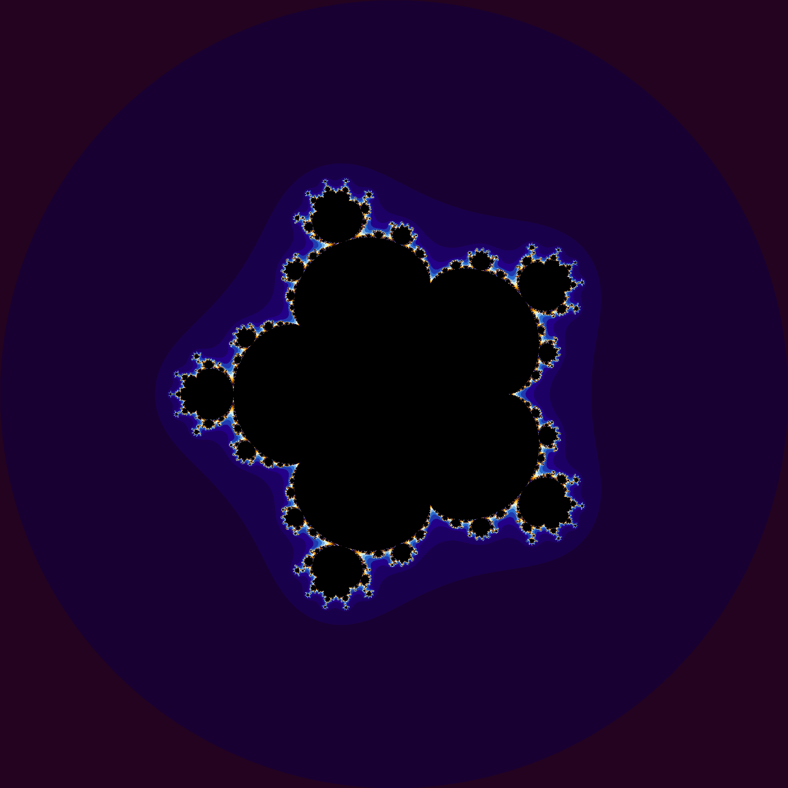

# Fractal Explorer

Fractal Generators in C.

Fractals included are MandelBrot, Julia, Generalized Mandelbrot.

## How to Use

./Mandelbrot xMin xMax yMin yMax

# Mandelbrot

Test if a complex number $c$ is a member of the mandelbrot set.

$$f_c(z) = z^2 + c$$

$$z_{n+1} = z_n^2 + c$$

c is a member of the mandelbrot set if, when starting with $z_0 = 0$ and applying the iteration repeatedly, the absolute value of $z_n$ remains bounded for all $n>0$.

MandelBrot Set render

## Intresting points to render:

Try rendering

./Mandelbrot 0.425 0.43 -0.2325 -0.23

./Mandelbrot -1.63 -1.62 -0.03 -0.02

-0.761574,-0.0847596
# Julia

Julia Set render

## Intresting points to render:

# Multibrot

Generalized MandelBrot Set render

# Compile and Run

gcc mandelbrot.c -o mandelbrot

## Run

./mandelbrot

## TODO

pack fractal function in function make loop use that function

better make file

Abstact up Color method to use in all fractals
Colors
Argument as parameter x= osv
Out images Argument

Max Iter as argument to getColor