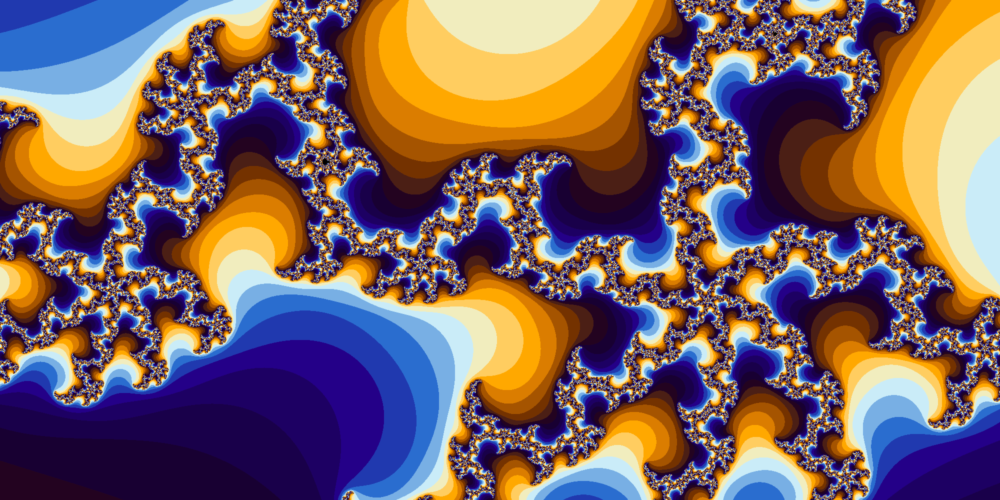
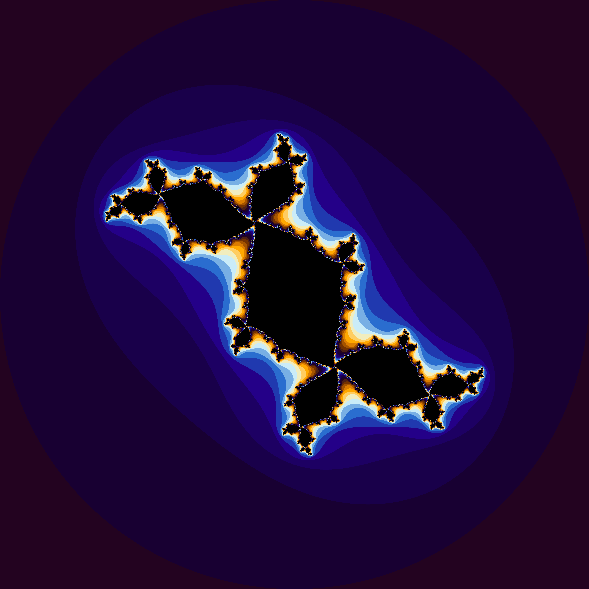

# Fractal Explorer

Fractal Generators in C.

# Mandelbrot

MandelBrot Set render

# Julia

Julia Set render

# Generalized Mandelbrot

Generalized MandelBrot Set render

# Compile and Run

gcc mandelbrot.c -o mandelbrot

## Run

./mandelbrot

## TODO

Size Area arguments
Colors
Out images